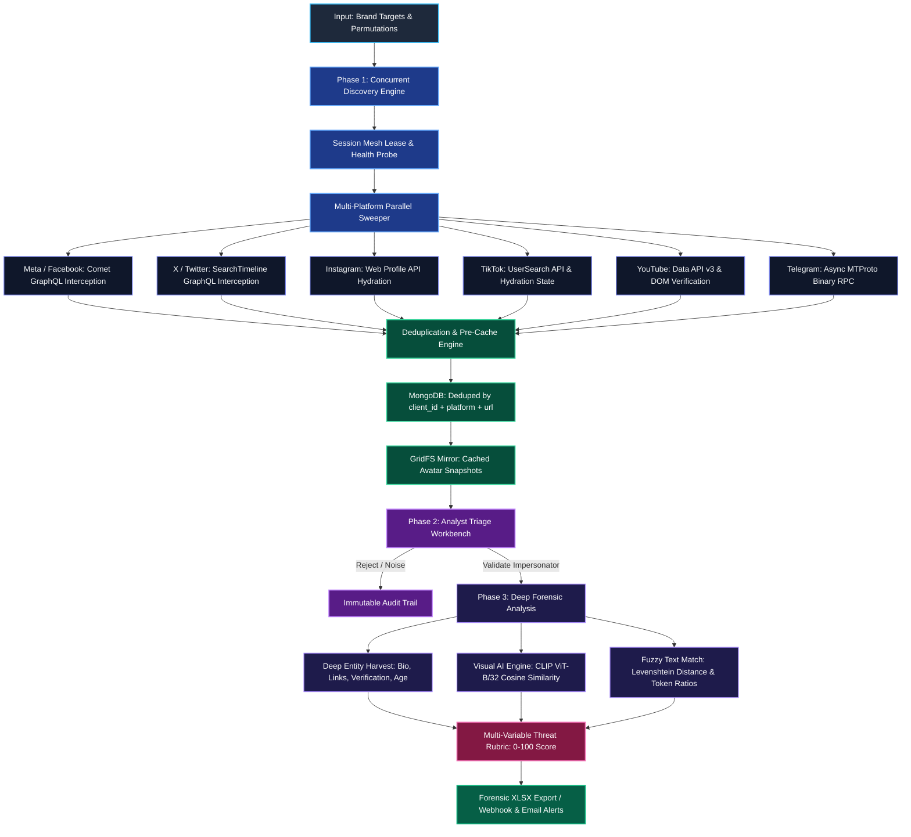

# Enterprise Brand Intelligence & Impersonation Detection Engine

[](https://www.python.org/)
[](https://fastapi.tiangolo.com/)
[](https://react.dev/)
[](https://mongodb.com/)
[](https://playwright.dev/)
[]()
[]()

An enterprise-grade, high-throughput brand protection microservice designed to discover, track, and score impersonator profiles, scam accounts, and counterfeit brand entities across major global social platforms in real time.

Built to solve real-world intelligence challenges: platform anti-bot behavioral heuristics, login checkpoints, volatile SPA view-models, chunked Comet GraphQL streams, and CDN avatar expiration. Combines wire-level network interception with neural computer vision (OpenAI CLIP) to deliver verifiable, takedown-ready forensic evidence.

---

## Architecture Overview



---

## Key Features

- **Multi-Platform Threat Intelligence**: Specialized reconnaissance adapters for:
  - **Meta / Facebook**: Comet search `/api/graphql` wire interception, server-rendered view-model decoding (`SearchProfileViewModel`), and checkpoint wall detection.
  - **X (Twitter)**: GraphQL `SearchTimeline` stream absorption, handle permutation extraction, and suspension tracking.
  - **Instagram**: Internal Web API hydration, anti-bot bypass, bio-link resolution, and private account detection.
  - **TikTok**: User search API chunk parsing, SSR hydration extraction, and anti-scraping settle pacing.
  - **YouTube**: Google Data API v3 integration with automated quota management and headless DOM channel verification.
  - **Telegram**: Direct MTProto binary wire protocol client via Telethon with automatic `FloodWait` budgeting.

- **Dual-Stage Reconnaissance Pipeline**:
  - **Phase 1 (Discovery)**: Asynchronously sweeps platform search engines with configurable result caps and automatic pagination, deduplicating candidate entities into MongoDB in real time.
  - **Phase 2 (Deep Analysis)**: Extracts full profile telemetry, followers, bio intent, and engagement metrics, scoring each candidate against a multi-variable threat rubric.

- **Wire-First GraphQL Interception (Anti-Fragile)**:
  - Attaches low-level response listeners to browser network sessions, parsing raw JSON directly from the wire. Bypasses fragile CSS selectors and ensures zero breakage when platform frontend layouts update.

- **Neural Computer Vision Logo Matching**:
  - Encodes brand logos and candidate profile pictures using OpenAI's `clip-vit-base-patch32` neural model (512-dimension vector cosine similarity) and perceptual hashing (pHash) to detect unauthorized logo usage, crops, and low-res alterations.

- **Stealth Browser Engine (Patchright)**:
  - Runs hardened Chromium sessions via Patchright to strip automation flags (`isBot`, `isAutomatedWithCDP`) below the JS runtime layer.
  - Simulates organic human interactions with non-linear Bézier cursor curves, natural deceleration, and circadian jitter pacing (`human.py`).

- **Self-Healing Session Mesh & Adaptive Quarantine**:
  - Pool multiple accounts per platform with automatic cookie persistence.
  - Distinguishes between transient network timeouts, rate limits (HTTP 429), and hard checkpoints. Checkpointed sessions enter graduated backoff (15m $\rightarrow$ 1h $\rightarrow$ 6h $\rightarrow$ 24h) while sibling workers seamlessly complete the run.
  - In-flight retry rollback prevents false error chips when retried sweeps succeed.

- **Evidence Mirroring & Forensic Export**:
  - Automatically captures and caches profile avatars into MongoDB GridFS before time-limited platform CDN links expire.
  - Generates comprehensive forensic workbooks (`.xlsx`) formatted for platform legal and abuse reporting.

---

## Platform Support Matrix

| Platform | Primary Extraction | Fallback Mechanism | Authentication | Anti-Bot / Pacing Strategy |
| :--- | :--- | :--- | :--- | :--- |
| **Facebook** | GraphQL `/api/graphql` Comet Stream | SSR `<script>` ViewModels + DOM | `c_user`, `xs` Cookies | Session Pool + Circadian Delay |
| **X (Twitter)**| GraphQL `SearchTimeline` Stream | DOM Article Fallback | `auth_token`, `ct0` Cookies | Token Bucket + Auto-Cooldown |
| **Instagram** | Internal Web API (`web_profile_info`) | DOM Hydration State | `sessionid`, `csrftoken` | Jitter Pacing + Exponential Backoff |
| **TikTok** | Internal Web API Stream | SSR Hydration State | `sessionid` Cookie | Settle Pacing + Anti-Detection |
| **YouTube** | Official Data API v3 | Headless DOM Verification | Google API Key / OAuth | Quota-Budgeted Throttling |
| **Telegram** | Native MTProto RPC Protocol | None (Binary Wire Protocol) | MTProto String Session | FloodWait Second-Budgeting |

---

## Security & Session Management

To inspect authenticated search pages and profile telemetry without triggering platform security walls or exposing personal credentials, this engine uses pooled research accounts.

> [!IMPORTANT]
> **Never commit session files or `cookies.json` to version control.** Session cookies (`c_user`, `xs`, `sessionid`, `auth_token`) grant full account access. All credential files in `session/` are strictly ignored by `.gitignore`.

### Configuring Platform Sessions

1. Export cookies from a dedicated research account using any standard Cookie-Editor browser extension (Export as JSON).
2. Save the exported JSON into the `session/` folder matching the platform ID:
   ```bash
   session/
   ├── facebook.json      # Requires c_user and xs
   ├── twitter.json       # Requires auth_token and ct0
   ├── instagram.json     # Requires sessionid and csrftoken
   └── telegram.session   # Telethon SQLite binary session
   ```
3. Alternatively, upload and manage sessions dynamically via the web dashboard at `http://127.0.0.1:8000/sessions`.

---

## Quickstart

### Prerequisites
- **Operating System:** Windows 10/11, macOS, or Linux (Ubuntu 22.04+)
- **Python:** 3.10 to 3.12
- **Node.js:** 18+ LTS
- **Database:** MongoDB 6.0+ listening on `mongodb://localhost:27017`
- **Browser:** Google Chrome (Stable) installed on default system path

### 1. Installation & Environment Check

```bash
# Clone the repository
git clone https://github.com/Saisanjay23/Brand-Intelligence-ultimate.git
cd Brand-Intelligence-ultimate

# Verify system prerequisites (Python, Node, Mongo, Chrome, sessions)
python run.py --check

# Automatic setup (installs Python dependencies, Playwright browsers, and builds UI)
python run.py --setup
```

### 2. Launching the Service

`python run.py` serves both the FastAPI REST backend and the compiled React production SPA on a single unified port:

```bash
# Production mode (serves API + UI on http://127.0.0.1:8000)
python run.py

# Development mode (FastAPI on :8000 + Vite HMR on :5173)
python run.py --dev

# Custom port
python run.py --port 9000
```

Interactive OpenAPI documentation is available at `http://127.0.0.1:8000/docs`.

---

## Testing & Quality Assurance

The codebase includes an extensive suite of 271 unit tests that run entirely offline without requiring live platform accounts or active MongoDB connections:

```bash
# Run backend test suite
python -m pytest backend/tests

# Run platform-specific resilience tests
python -m pytest backend/tests -k "facebook or discovery or sweep"

# Run frontend unit tests
cd frontend && npm test
```

---

## Directory Structure

```text
├── backend/
│   ├── main.py                  # FastAPI ASGI application entrypoint & lifespan
│   ├── api/                     # Domain HTTP routers (discovery, analysis, sessions, reports)
│   ├── discovery/               # Search sweeping engine, caps, and queue manager
│   ├── analysis/                # Deep scraping orchestrator and risk scoring engine
│   ├── platforms/               # Platform adapters (Facebook, Twitter, Instagram, TikTok, YouTube, Telegram)
│   ├── sessions/                # Session manager, lease coordination, and health probes
│   ├── database/                # Motor MongoDB async client and repositories
│   ├── services/                # Avatar caching (GridFS), CLIP logo matching, Excel generation
│   ├── stealth/                 # Patchright browser wrapper, Bézier cursor, and human pacing
│   └── tests/                   # Pytest test suite (271 passing tests)
├── frontend/
│   ├── src/                     # React 18 TypeScript source code
│   │   ├── pages/               # Triage grid, live monitors, session admin, and reports
│   │   └── components/          # Virtualized tables, platform badges, risk chips
│   └── dist/                    # Compiled production assets mounted by FastAPI
├── session/                     # Local session stores (gitignored)
├── runs/                        # Exported forensic XLSX reports
└── run.py                       # Single-command environment bootstrapper
```

---

## License & Compliance

This tool is designed strictly for authorized brand defense, corporate security investigations, and legal intellectual property protection. Operates exclusively in a read-only posture (zero likes, zero messages, zero automated interactions).
